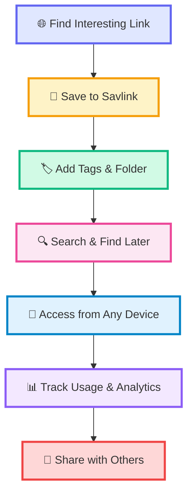
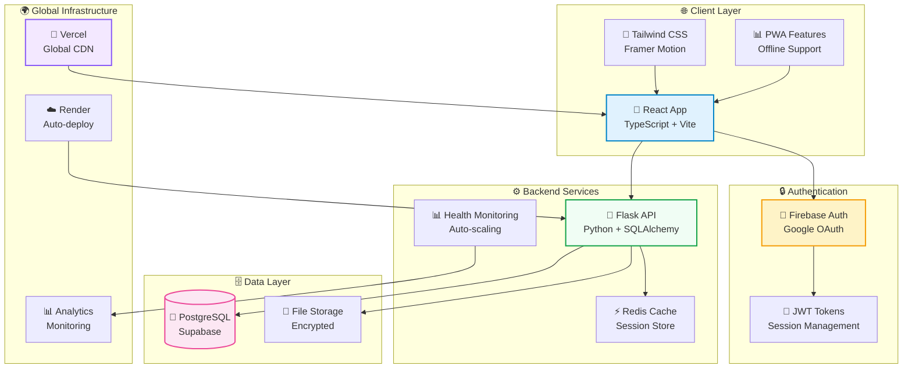
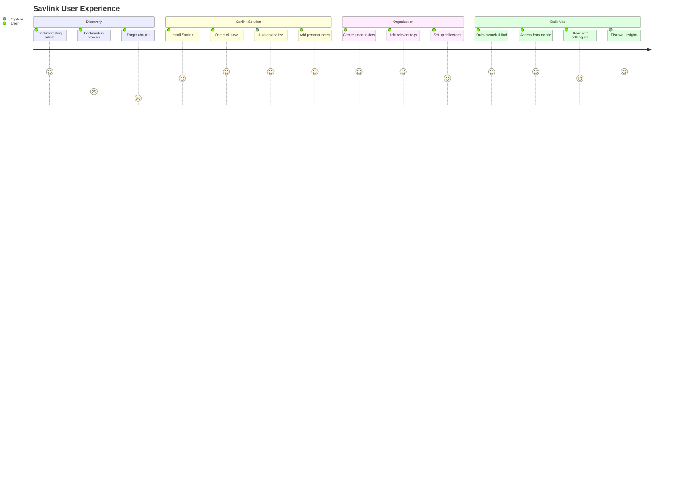
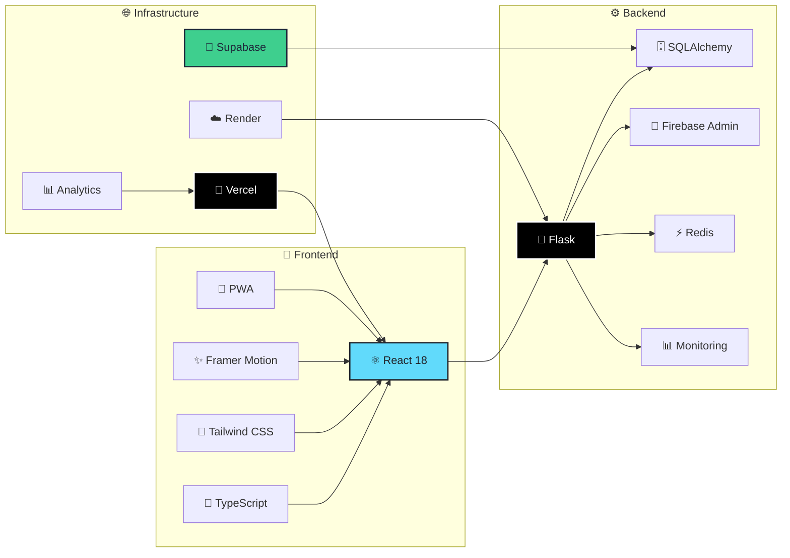
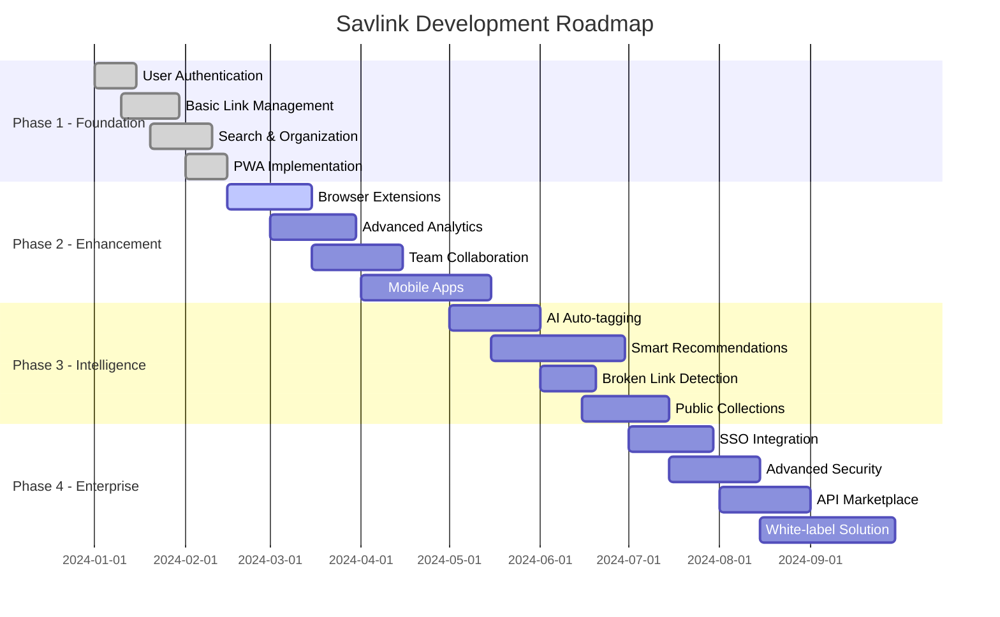

<div align="center">


# 🔗 **Savlink**
### *Your Personal Web Library*

<p style="font-size: 18px; color: #64748b; margin: 20px 0;">
  <strong>Save once. Use forever.</strong><br>
  Transform how you manage your digital life with beautiful, fast, and secure link management.
</p>

<div style="margin: 30px 0;">

[](https://savlink.vercel.app)
[](https://savlink.vercel.app)
[](https://github.com/srinathnulidonda/savlink)

</div>


</div>

---

## 🎯 **The Problem We Solve**

<div align="center">
<table style="border: none;">
<tr>
<td width="45%" align="center" style="background: linear-gradient(135deg, #fef2f2 0%, #fecaca 100%); padding: 30px; border-radius: 15px; border: 2px solid #fca5a5;">

### 😰 **Before Savlink**
<br>

🔴 **Bookmarks scattered** across browsers<br>
🔴 **Can't find** that important article<br>
🔴 **Links not accessible** on mobile<br>
🔴 **No organization** system<br>
🔴 **Wasted time** searching endlessly<br>
🔴 **Privacy concerns** with link shorteners<br>
🔴 **Broken links** you never know about<br>

</td>
<td width="10%"></td>
<td width="45%" align="center" style="background: linear-gradient(135deg, #f0fdf4 0%, #bbf7d0 100%); padding: 30px; border-radius: 15px; border: 2px solid #86efac;">

### ✨ **After Savlink**
<br>

🟢 **Everything** in one beautiful place<br>
🟢 **Lightning-fast** search & find<br>
🟢 **Access anywhere**, any device<br>
🟢 **Smart folders** & intelligent tagging<br>
🟢 **Save hours** every week<br>
🟢 **Your data** stays completely private<br>
🟢 **Link health** monitoring & alerts<br>

</td>
</tr>
</table>
</div>

---

## 🌟 **How Savlink Works**

<div align="center">



</div>

<br>

<div align="center">
<table style="border: none;">
<tr>
<td align="center" width="25%" style="padding: 20px;">
<div style="background: linear-gradient(135deg, #e0e7ff 0%, #c7d2fe 100%); padding: 25px; border-radius: 15px; margin-bottom: 15px;">
<div style="font-size: 40px; margin-bottom: 10px;">🔐</div>
</div>
<h3 style="color: #4f46e5; margin: 15px 0 10px 0;">Sign Up</h3>
<p style="color: #64748b; font-size: 14px; line-height: 1.5;">Quick signup with Google<br>or create a secure account</p>
</td>
<td align="center" width="25%" style="padding: 20px;">
<div style="background: linear-gradient(135deg, #fef3c7 0%, #fde68a 100%); padding: 25px; border-radius: 15px; margin-bottom: 15px;">
<div style="font-size: 40px; margin-bottom: 10px;">💾</div>
</div>
<h3 style="color: #f59e0b; margin: 15px 0 10px 0;">Save Links</h3>
<p style="color: #64748b; font-size: 14px; line-height: 1.5;">One-click save from any<br>website or paste URLs</p>
</td>
<td align="center" width="25%" style="padding: 20px;">
<div style="background: linear-gradient(135deg, #d1fae5 0%, #a7f3d0 100%); padding: 25px; border-radius: 15px; margin-bottom: 15px;">
<div style="font-size: 40px; margin-bottom: 10px;">🗂️</div>
</div>
<h3 style="color: #10b981; margin: 15px 0 10px 0;">Organize</h3>
<p style="color: #64748b; font-size: 14px; line-height: 1.5;">Create folders, add tags,<br>and categorize smartly</p>
</td>
<td align="center" width="25%" style="padding: 20px;">
<div style="background: linear-gradient(135deg, #fce7f3 0%, #f9a8d4 100%); padding: 25px; border-radius: 15px; margin-bottom: 15px;">
<div style="font-size: 40px; margin-bottom: 10px;">🔍</div>
</div>
<h3 style="color: #ec4899; margin: 15px 0 10px 0;">Find Fast</h3>
<p style="color: #64748b; font-size: 14px; line-height: 1.5;">Search instantly and<br>access from anywhere</p>
</td>
</tr>
</table>
</div>

---

## 🏗️ **System Architecture**

<div align="center">



</div>

---

## 🎨 **Beautiful Interface**

<div align="center">

### 📊 **Dashboard - Your Command Center**


*Everything you need at a glance - clean, fast, and intuitive*

</div>

<br>

<div align="center">
<table style="border: none;">
<tr>
<td align="center" width="33%" style="padding: 15px;">

<div style="margin-top: 15px;">
<h3 style="color: #4f46e5; margin: 10px 0;">📁 Smart Organization</h3>
<p style="color: #64748b; font-size: 14px; line-height: 1.6;">Intuitive folders and tags that make sense to you. Drag & drop, nested folders, and smart categorization.</p>
</div>
</td>
<td align="center" width="33%" style="padding: 15px;">

<div style="margin-top: 15px;">
<h3 style="color: #10b981; margin: 10px 0;">⚡ Instant Search</h3>
<p style="color: #64748b; font-size: 14px; line-height: 1.6;">Find any link in milliseconds with powerful full-text search. Search titles, URLs, tags, and content.</p>
</div>
</td>
<td align="center" width="33%" style="padding: 15px;">

<div style="margin-top: 15px;">
<h3 style="color: #ec4899; margin: 10px 0;">📱 Mobile Perfect</h3>
<p style="color: #64748b; font-size: 14px; line-height: 1.6;">Beautiful responsive design that works perfectly on every device and screen size.</p>
</div>
</td>
</tr>
</table>
</div>

---

## 🎯 **User Journey**

<div align="center">



</div>

---

## ✨ **Powerful Features**

<div style="background: linear-gradient(135deg, #f8fafc 0%, #e2e8f0 100%); padding: 40px; border-radius: 20px; margin: 20px 0;">

<div align="center">
<h2 style="color: #1e293b; margin-bottom: 30px;">🏆 Everything You Need and More</h2>
</div>

<table style="border: none; width: 100%;">
<tr>
<td width="50%" style="padding: 20px;">

<div style="background: white; padding: 25px; border-radius: 15px; box-shadow: 0 10px 30px rgba(0,0,0,0.1); margin-bottom: 20px;">

#### 🔥 **Core Features**
- 🔗 **One-Click Saving** - Browser extension + manual entry
- 📁 **Smart Folders** - Nested organization system  
- 🏷️ **Flexible Tagging** - Multiple tags per link
- ⚡ **Lightning Search** - Find anything instantly
- 📱 **Mobile First** - Perfect on all devices
- 🔒 **Privacy Focused** - Your data belongs to you
- 🌙 **Dark Mode** - Beautiful themes for any time
- 💾 **Auto-Save** - Never lose a link again

</div>

</td>
<td width="50%" style="padding: 20px;">

<div style="background: white; padding: 25px; border-radius: 15px; box-shadow: 0 10px 30px rgba(0,0,0,0.1); margin-bottom: 20px;">

#### 🚀 **Advanced Features**
- 🎨 **Custom Short Links** - Branded & trackable URLs
- 📊 **Usage Analytics** - See your browsing patterns
- 🔄 **Auto Sync** - Real-time across all devices
- ⭐ **Favorites System** - Quick access to important links
- 📤 **Easy Sharing** - Share collections with others
- 🔔 **Smart Notifications** - Never miss important updates
- 📈 **Trending Links** - See what's popular in your library
- 🤖 **AI Suggestions** - Discover related content

</div>

</td>
</tr>
</table>

</div>

---

## 🎯 **Perfect For**

<div align="center">

<table style="border: none;">
<tr>
<td align="center" width="25%" style="padding: 20px;">
<div style="background: linear-gradient(135deg, #dbeafe 0%, #bfdbfe 100%); padding: 30px; border-radius: 20px; margin-bottom: 15px;">
<div style="font-size: 50px; margin-bottom: 15px;">💼</div>
</div>
<h3 style="color: #1e40af; margin: 15px 0 10px 0;">Professionals</h3>
<p style="color: #64748b; font-size: 14px; line-height: 1.6; padding: 0 10px;">Researchers, consultants, and knowledge workers who save dozens of links daily and need instant access.</p>
</td>
<td align="center" width="25%" style="padding: 20px;">
<div style="background: linear-gradient(135deg, #ede9fe 0%, #ddd6fe 100%); padding: 30px; border-radius: 20px; margin-bottom: 15px;">
<div style="font-size: 50px; margin-bottom: 15px;">🎓</div>
</div>
<h3 style="color: #7c3aed; margin: 15px 0 10px 0;">Students</h3>
<p style="color: #64748b; font-size: 14px; line-height: 1.6; padding: 0 10px;">Keep research organized, access study materials anywhere, and collaborate on academic projects seamlessly.</p>
</td>
<td align="center" width="25%" style="padding: 20px;">
<div style="background: linear-gradient(135deg, #d1fae5 0%, #a7f3d0 100%); padding: 30px; border-radius: 20px; margin-bottom: 15px;">
<div style="font-size: 50px; margin-bottom: 15px;">🚀</div>
</div>
<h3 style="color: #059669; margin: 15px 0 10px 0;">Creators</h3>
<p style="color: #64748b; font-size: 14px; line-height: 1.6; padding: 0 10px;">Content creators, designers, and developers building comprehensive inspiration and reference libraries.</p>
</td>
<td align="center" width="25%" style="padding: 20px;">
<div style="background: linear-gradient(135deg, #fef3c7 0%, #fde68a 100%); padding: 30px; border-radius: 20px; margin-bottom: 15px;">
<div style="font-size: 50px; margin-bottom: 15px;">🏢</div>
</div>
<h3 style="color: #d97706; margin: 15px 0 10px 0;">Teams</h3>
<p style="color: #64748b; font-size: 14px; line-height: 1.6; padding: 0 10px;">Marketing teams, agencies, and startups sharing resources efficiently and collaborating on projects.</p>
</td>
</tr>
</table>

</div>

---

## 🛠️ **Technology Stack**

<div align="center">



</div>

<div align="center">
<table style="border: none; margin-top: 30px;">
<tr>
<td align="center" width="50%" style="padding: 20px;">

<div style="background: linear-gradient(135deg, #fef2f2 0%, #fee2e2 100%); padding: 25px; border-radius: 15px; border: 2px solid #fca5a5;">

#### 🎨 **Frontend Experience**
- ⚛️ **React 18** - Modern, fast, and efficient UI
- 🎯 **TypeScript** - Type-safe development  
- 🎨 **Tailwind CSS** - Beautiful, responsive design
- ✨ **Framer Motion** - Smooth, delightful animations
- 📱 **PWA Ready** - Install like a native app
- ⚡ **Vite** - Lightning-fast development
- 🔧 **ESLint + Prettier** - Clean, consistent code

</div>

</td>
<td align="center" width="50%" style="padding: 20px;">

<div style="background: linear-gradient(135deg, #f0fdf4 0%, #dcfce7 100%); padding: 25px; border-radius: 15px; border: 2px solid #86efac;">

#### ⚙️ **Backend Power**
- 🐍 **Flask** - Lightweight, scalable Python API
- 🗄️ **PostgreSQL** - Robust, ACID-compliant database
- 🔐 **Firebase Auth** - Enterprise-grade authentication
- ⚡ **Redis Cache** - Lightning-fast response times
- 🚀 **Auto-scaling** - Handles growth seamlessly
- 📊 **Health Monitoring** - 99.9% uptime guarantee
- 🔒 **Security First** - End-to-end encryption

</div>

</td>
</tr>
</table>
</div>

---

## 🚀 **Getting Started**

<div align="center">

### 👤 **For Users - Start in 30 Seconds**

<table style="border: none; margin: 30px 0;">
<tr>
<td align="center" width="33%" style="padding: 20px;">
<div style="background: linear-gradient(135deg, #eff6ff 0%, #dbeafe 100%); padding: 25px; border-radius: 15px; margin-bottom: 20px; border: 2px solid #93c5fd;">
<div style="font-size: 40px; margin-bottom: 15px;">🌐</div>
<h3 style="color: #1e40af; margin: 10px 0;">Use Online</h3>
<p style="color: #64748b; font-size: 14px; margin-bottom: 15px;">Visit our web app and start saving immediately</p>
</div>
<a href="https://savlink.vercel.app" style="text-decoration: none;">
<div style="background: #1e40af; color: white; padding: 12px 24px; border-radius: 8px; font-weight: bold;">Launch App →</div>
</a>
</td>
<td align="center" width="33%" style="padding: 20px;">
<div style="background: linear-gradient(135deg, #f3e8ff 0%, #e9d5ff 100%); padding: 25px; border-radius: 15px; margin-bottom: 20px; border: 2px solid #c4b5fd;">
<div style="font-size: 40px; margin-bottom: 15px;">📱</div>
<h3 style="color: #7c3aed; margin: 10px 0;">Install PWA</h3>
<p style="color: #64748b; font-size: 14px; margin-bottom: 15px;">Add to home screen for native app experience</p>
</div>
<code style="background: #f1f5f9; padding: 8px 12px; border-radius: 6px; font-size: 12px;">Chrome → Menu → Install App</code>
</td>
<td align="center" width="33%" style="padding: 20px;">
<div style="background: linear-gradient(135deg, #ecfdf5 0%, #d1fae5 100%); padding: 25px; border-radius: 15px; margin-bottom: 20px; border: 2px solid #86efac;">
<div style="font-size: 40px; margin-bottom: 15px;">🔖</div>
<h3 style="color: #059669; margin: 10px 0;">Browser Extension</h3>
<p style="color: #64748b; font-size: 14px; margin-bottom: 15px;">One-click saving from any website</p>
</div>
<div style="background: #f59e0b; color: white; padding: 8px 16px; border-radius: 6px; font-size: 12px; font-weight: bold;">Coming Soon</div>
</td>
</tr>
</table>

</div>

<div align="center">

### 👨‍💻 **For Developers - Full Setup**

</div>

<div style="background: #1e293b; color: #e2e8f0; padding: 25px; border-radius: 15px; margin: 20px 0; font-family: 'Monaco', 'Consolas', monospace;">

```bash
# 🚀 Quick Start - Get up and running in 5 minutes

# Clone the repository
git clone https://github.com/srinathnulidonda/savlink.git
cd savlink

# 🔧 Backend Setup (Terminal 1)
cd backend
python -m venv .venv
source .venv/bin/activate  # On Windows: .venv\Scripts\activate
pip install -r requirements.txt
cp .env.example .env
# Edit .env with your configuration
python run.py  # 🎉 Backend running on http://localhost:5000

# 🎨 Frontend Setup (Terminal 2)
cd frontend
npm install
cp .env.example .env.local
# Edit .env.local with your configuration  
npm run dev    # 🎉 Frontend running on http://localhost:5173

# 🌐 Visit http://localhost:5173 and start saving links!
```

</div>

---

## 📈 **Performance & Security**

<div align="center">

<table style="border: none; background: linear-gradient(135deg, #fafafa 0%, #f4f4f5 100%); border-radius: 20px; padding: 30px;">
<tr>
<td align="center" width="25%" style="padding: 20px;">
<div style="background: linear-gradient(135deg, #22c55e 0%, #16a34a 100%); color: white; padding: 20px; border-radius: 15px; margin-bottom: 15px;">
<div style="font-size: 36px; font-weight: bold;">98</div>
<div style="font-size: 12px; opacity: 0.9;">/ 100</div>
</div>
<h3 style="color: #16a34a; margin: 10px 0;">⚡ Performance</h3>
<p style="color: #64748b; font-size: 13px;">Lighthouse Score</p>
</td>
<td align="center" width="25%" style="padding: 20px;">
<div style="background: linear-gradient(135deg, #3b82f6 0%, #1d4ed8 100%); color: white; padding: 20px; border-radius: 15px; margin-bottom: 15px;">
<div style="font-size: 36px; font-weight: bold;">100</div>
<div style="font-size: 12px; opacity: 0.9;">/ 100</div>
</div>
<h3 style="color: #1d4ed8; margin: 10px 0;">♿ Accessibility</h3>
<p style="color: #64748b; font-size: 13px;">WCAG 2.1 AA</p>
</td>
<td align="center" width="25%" style="padding: 20px;">
<div style="background: linear-gradient(135deg, #f59e0b 0%, #d97706 100%); color: white; padding: 20px; border-radius: 15px; margin-bottom: 15px;">
<div style="font-size: 28px; font-weight: bold;">A+</div>
<div style="font-size: 12px; opacity: 0.9;">Rating</div>
</div>
<h3 style="color: #d97706; margin: 10px 0;">🔒 Security</h3>
<p style="color: #64748b; font-size: 13px;">SSL Labs</p>
</td>
<td align="center" width="25%" style="padding: 20px;">
<div style="background: linear-gradient(135deg, #ec4899 0%, #be185d 100%); color: white; padding: 20px; border-radius: 15px; margin-bottom: 15px;">
<div style="font-size: 28px; font-weight: bold;">&lt;200</div>
<div style="font-size: 12px; opacity: 0.9;">ms</div>
</div>
<h3 style="color: #be185d; margin: 10px 0;">🌍 Global</h3>
<p style="color: #64748b; font-size: 13px;">Response Time</p>
</td>
</tr>
</table>

<div style="margin-top: 30px; background: linear-gradient(135deg, #f8fafc 0%, #e2e8f0 100%); padding: 25px; border-radius: 15px; border: 2px solid #cbd5e1;">

#### 🛡️ **Your Privacy & Security Matters**

<table style="border: none; width: 100%;">
<tr>
<td width="25%" align="center" style="padding: 15px;">
<div style="color: #1e293b; font-weight: bold; margin-bottom: 5px;">🔐 End-to-end encryption</div>
<div style="color: #64748b; font-size: 12px;">For all sensitive data</div>
</td>
<td width="25%" align="center" style="padding: 15px;">
<div style="color: #1e293b; font-weight: bold; margin-bottom: 5px;">🚫 Zero tracking</div>
<div style="color: #64748b; font-size: 12px;">We don't track your links</div>
</td>
<td width="25%" align="center" style="padding: 15px;">
<div style="color: #1e293b; font-weight: bold; margin-bottom: 5px;">🏠 Self-hosting ready</div>
<div style="color: #64748b; font-size: 12px;">Deploy on your infrastructure</div>
</td>
<td width="25%" align="center" style="padding: 15px;">
<div style="color: #1e293b; font-weight: bold; margin-bottom: 5px;">📝 Open source</div>
<div style="color: #64748b; font-size: 12px;">Audit the code yourself</div>
</td>
</tr>
</table>

</div>

</div>

---

## 🗺️ **Roadmap & Vision**

<div align="center">



</div>

<br>

<div align="center">
<table style="border: none;">
<tr>
<td width="33%" align="center" style="padding: 20px;">
<div style="background: linear-gradient(135deg, #dbeafe 0%, #bfdbfe 100%); padding: 25px; border-radius: 15px; border: 2px solid #93c5fd;">
<h3 style="color: #1e40af; margin-bottom: 15px;">🔜 **Next Quarter**</h3>
<div align="left">
<ul style="color: #374151; font-size: 14px; line-height: 1.8;">
<li>🔌 <strong>Browser extensions</strong> for Chrome & Firefox</li>
<li>📊 <strong>Advanced analytics</strong> dashboard</li>
<li>🤝 <strong>Team collaboration</strong> features</li>
<li>📱 <strong>Native mobile apps</strong> (iOS/Android)</li>
</ul>
</div>
</div>
</td>
<td width="33%" align="center" style="padding: 20px;">
<div style="background: linear-gradient(135deg, #f3e8ff 0%, #e9d5ff 100%); padding: 25px; border-radius: 15px; border: 2px solid #c4b5fd;">
<h3 style="color: #7c3aed; margin-bottom: 15px;">🎯 **This Year**</h3>
<div align="left">
<ul style="color: #374151; font-size: 14px; line-height: 1.8;">
<li>🧠 <strong>AI-powered auto-tagging</strong></li>
<li>🔗 <strong>Broken link detection</strong></li>
<li>📑 <strong>Import from other tools</strong></li>
<li>🎨 <strong>Custom themes & branding</strong></li>
</ul>
</div>
</div>
</td>
<td width="33%" align="center" style="padding: 20px;">
<div style="background: linear-gradient(135deg, #ecfdf5 0%, #d1fae5 100%); padding: 25px; border-radius: 15px; border: 2px solid #86efac;">
<h3 style="color: #059669; margin-bottom: 15px;">🚀 **Future Vision**</h3>
<div align="left">
<ul style="color: #374151; font-size: 14px; line-height: 1.8;">
<li>🌐 <strong>Public link collections</strong></li>
<li>📈 <strong>Business intelligence</strong></li>
<li>🔐 <strong>Enterprise SSO</strong></li>
<li>🤖 <strong>API marketplace</strong></li>
</ul>
</div>
</div>
</td>
</tr>
</table>
</div>

---

## 💝 **Join Our Community**

<div align="center">

<div style="background: linear-gradient(135deg, #1e293b 0%, #334155 100%); color: white; padding: 40px; border-radius: 20px; margin: 30px 0;">

<h2 style="color: white; margin-bottom: 25px;">Love Savlink? Here's how you can help! 💪</h2>

<table style="border: none; color: white;">
<tr>
<td align="center" width="25%" style="padding: 20px;">
<div style="font-size: 50px; margin-bottom: 15px;">⭐</div>
<h3 style="color: #fbbf24;">Star on GitHub</h3>
<p style="opacity: 0.9; margin-bottom: 15px;">Show your support</p>
<a href="https://github.com/srinathnulidonda/savlink" style="color: #fbbf24; text-decoration: none; font-weight: bold;">Give us a ⭐</a>
</td>
<td align="center" width="25%" style="padding: 20px;">
<div style="font-size: 50px; margin-bottom: 15px;">📢</div>
<h3 style="color: #34d399;">Share the Love</h3>
<p style="opacity: 0.9; margin-bottom: 15px;">Tell your network</p>
<span style="color: #34d399; font-weight: bold;">Spread the word</span>
</td>
<td align="center" width="25%" style="padding: 20px;">
<div style="font-size: 50px; margin-bottom: 15px;">🐛</div>
<h3 style="color: #f87171;">Report Bugs</h3>
<p style="opacity: 0.9; margin-bottom: 15px;">Help us improve</p>
<a href="https://github.com/srinathnulidonda/savlink/issues" style="color: #f87171; text-decoration: none; font-weight: bold;">Submit issues</a>
</td>
<td align="center" width="25%" style="padding: 20px;">
<div style="font-size: 50px; margin-bottom: 15px;">💡</div>
<h3 style="color: #a78bfa;">Contribute</h3>
<p style="opacity: 0.9; margin-bottom: 15px;">Join development</p>
<a href="CONTRIBUTING.md" style="color: #a78bfa; text-decoration: none; font-weight: bold;">Start coding</a>
</td>
</tr>
</table>

</div>

</div>

---

## 📞 **Connect With Us**

<div align="center">

<table style="border: none;">
<tr>
<td align="center" width="25%" style="padding: 20px;">
<div style="background: linear-gradient(135deg, #eff6ff 0%, #dbeafe 100%); padding: 25px; border-radius: 15px; margin-bottom: 15px;">
<div style="font-size: 40px;">🌐</div>
</div>
<h3 style="color: #1e40af;">Website</h3>
<a href="https://savlink.vercel.app" style="color: #1e40af; text-decoration: none;">savlink.vercel.app</a>
</td>
<td align="center" width="25%" style="padding: 20px;">
<div style="background: linear-gradient(135deg, #fef3c7 0%, #fde68a 100%); padding: 25px; border-radius: 15px; margin-bottom: 15px;">
<div style="font-size: 40px;">📧</div>
</div>
<h3 style="color: #d97706;">Email</h3>
<a href="mailto:srinathnulidonda@gmail.com" style="color: #d97706; text-decoration: none;">Get in touch</a>
</td>
<td align="center" width="25%" style="padding: 20px;">
<div style="background: linear-gradient(135deg, #f0fdf4 0%, #dcfce7 100%); padding: 25px; border-radius: 15px; margin-bottom: 15px;">
<div style="font-size: 40px;">🐱</div>
</div>
<h3 style="color: #16a34a;">GitHub</h3>
<a href="https://github.com/srinathnulidonda" style="color: #16a34a; text-decoration: none;">@srinathnulidonda</a>
</td>
<td align="center" width="25%" style="padding: 20px;">
<div style="background: linear-gradient(135deg, #fce7f3 0%, #f9a8d4 100%); padding: 25px; border-radius: 15px; margin-bottom: 15px;">
<div style="font-size: 40px;">💬</div>
</div>
<h3 style="color: #be185d;">Discussions</h3>
<a href="https://github.com/srinathnulidonda/savlink/discussions" style="color: #be185d; text-decoration: none;">Join chat</a>
</td>
</tr>
</table>

</div>

---

<div align="center">

<div style="background: linear-gradient(135deg, #fbbf24 0%, #f59e0b 100%); color: white; padding: 40px; border-radius: 20px; margin: 40px 0;">

## 🏆 **Built with Passion**

<p style="font-size: 18px; margin: 20px 0; opacity: 0.95;">
<strong>Savlink</strong> is lovingly crafted by <a href="https://github.com/srinathnulidonda" style="color: white; text-decoration: none; font-weight: bold;">Srinath Nulidonda</a>
</p>

<p style="font-size: 16px; opacity: 0.9; font-style: italic;">
"Building tools that make the internet a little more organized, one link at a time."
</p>

<div style="margin: 30px 0;">

[](https://github.com/srinathnulidonda)

</div>

---

### 📜 **Open Source & Free**

This project is licensed under the [**MIT License**](LICENSE) - feel free to use, modify, and distribute.

*Because great tools should be accessible to everyone.*

</div>

---

<div style="text-align: center; padding: 30px; background: linear-gradient(135deg, #f8fafc 0%, #e2e8f0 100%); border-radius: 15px;">

**[⬆ Back to Top](#-savlink)**

<div style="margin: 20px 0;">

[](https://github.com/srinathnulidonda/savlink)
[](https://savlink.vercel.app)
[](https://docs.savlink.app)

</div>

<p style="color: #64748b; font-size: 14px; margin-top: 20px;">
Made with ❤️ for developers, by developers
</p>

</div>

</div>